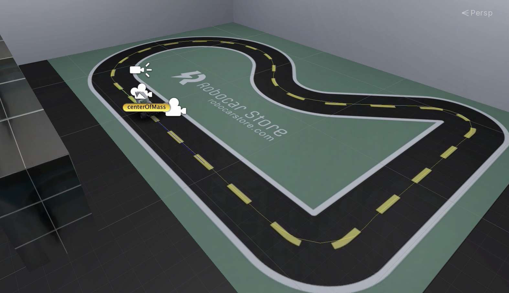
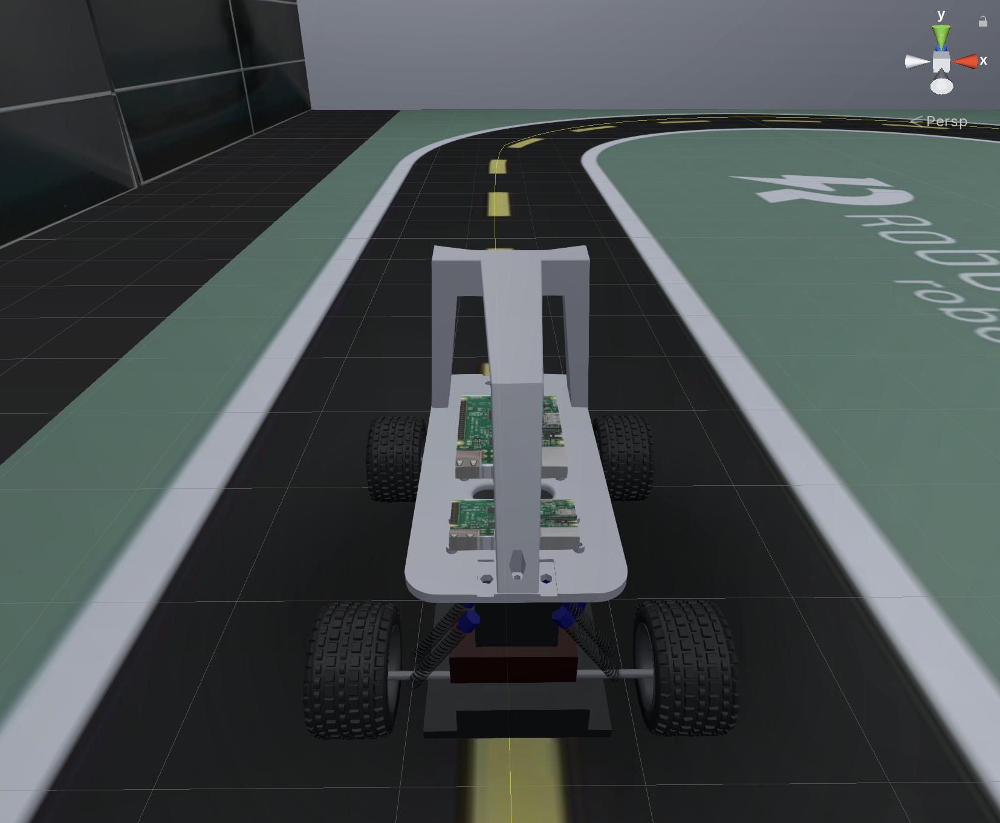

# Formula USI 2021 Warm-up Assignment

Assignment in preparation for the FORMULA USI 2021 Challenge, 5--7 November 2021, Campus Est, Lugano, Switzerland. This task is preparatory to what the Challenge would require you to do, thus do it to the best of your possibilities!

## Testbed

At FORMULA USI 2021 you will build a real small-scale [Donkey Car](https://www.donkeycar.com/) driving on a real track. For this assignment, we require you to build a virtual Donkey Car driving on a virtual road in a simulator. Below is the virtual racing track.

*Virtual Environment (Unity)*






### Task

Build a deep neural network model that performs lane-keeping and that is able to drive our short training track (see picture above). The vehicle should be able to drive in autonomous mode on the entire track with the least number of failures (i.e., crashes or out-of-track episodes). Below is an example of driving model:


## Requisites
Python 3.7, git 64 bit, [miniconda 3.7 64 bit](https://docs.conda.io/en/latest/miniconda.html).

**Software setup:** We encourage using the PyCharm IDE by JetBrains. We used PyCharm Professional 2020.3 and Python 3.7.

**Hardware setup:** Training the DNN models (self-driving cars) is computationally expensive on large datasets. Therefore, we recommend using a machine with a GPU. Given the limited size of the track, you should be able to complete the task successfully also on more resources-constrained hardware. Eventually, see the step [Training on Google Colab](#training-on-google-colab) to train the model on the cloud.

## Donkey Car Installation

We use Donkey Car v3.1.5. Two Python packages are needed to run this repository (1) *donkeycar* and (2) *gym-donkeycar*, which need to be installed on your machine.

To install the *donkeycar* package, perform the following commands

```
* git clone https://github.com/autorope/donkeycar.git
* cd donkeycar
* git checkout a91f88d
* conda update -n base -c defaults conda
* conda env remove -n donkey
* conda env create -f install/envs/<your-os>.yml (your-os: [mac, windows, ubuntu])
* conda activate donkey
* pip install -e .\[pc\] (ZSH version)
* pip install -e .[pc] (Bash version)
```

To install the *gym-donkeycar* package, perform the following commands

```
* git clone https://github.com/tawnkramer/gym-donkeycar
* cd gym-donkeycar
* conda activate donkey
* pip install -e .\[gym-donkeycar\] (ZSH version)
* pip install -e .[gym-donkeycar] (Bash version)
```

To create a new Donkey Car project, perform the following commands

```
* conda activate donkey
* donkey createcar --path mycar/
```

This will create a `mycar/` folder. This will be your working folder for data collection, model training, and testing. 

In case of issues, you can also refer to the original [documentation](http://docs.donkeycar.com/guide/install_software/). 

**Important:** Make sure your code runs with Tensorflow 1.x. No TensorFlow 2 models will be accepted.

## Donkey Car Simulator

You need to download and use [our simulator](https://drive.google.com/drive/folders/1iZP2LKnRvib6T6yFSuGrhwtPUpeL9pXC?usp=sharing) (macOS/Windows/Linux).

During autonomous (but also manual) driving, the simulator automatically records the driving behavior and stores it into CSV files in a `Testing` directory (on macOS it is accessible by right-clicking the `donkey-sim-mac` file --> `Show Package Contents` --> `Contents`). The generated files are two:

* `Simulation-<timestamp>.csv` records the telemetry for an entire simulation
* `Laps - <timestamp>.csv` records the aggregates on a per lap basis.

## Building the Self-Driving Car

### Data Collection

1. Create a directory where you want to save your training data to. Best option is to create a new folder within the `data/` folder of your `mycar/` project
2. Open the simulator
3. Click `Log dir`
4. Select the newly created folder
5. Select the scene `Sandbox Track`
6. Select the button `Joystick/Keyboard w Rec`
7. Drive manually trying to stay as much as possible at the center of the track. For a decent model, 10 to 30 laps should be sufficient.

#### Data Cleaning

There is a handy tool provided by the `donkey` package to "clean" the dataset collected in the previous step from unwanted/suboptimal driving data. For example, it can be used to remove the images corresponding to the parts of the track in which you did not drive well :wink:).

1. `conda activate donkey`
2. `donkey tubclean mycar`
3. `click on the 'data' folder` (assuming the `Log Dir` selected above is `mycar/data`)

The tool opens a web server at the address `localhost:8886` and allows to handle the collected stream of images like a video file. You can delete the images you do not want to be in your dataset. The usage is as follows: navigate the stream of images up to the frame in which you want to start deleting. Click `Split`. You should see a second stream being created. Navigate the second stream up to the frame in which you want to stop deleting. Click `Split` again. Now you should see three streams; the one you want to delete is the second. Click the red button named `Save and Delete Training Data`. Repeat the procedure for all subsequences you wish to delete.

### Training

Train a [default model](https://docs.donkeycar.com/parts/keras/) using the collected data and data augmentation. You can do it using the following command

```
python train.py --model <modelname>.h5 --tub <data> --type linear --aug
```

Eventually, you can modify the training hyperparameter in the `myconfig.py` file.

#### Training on Google Colab

If you do not have a GPU available, or if training the model on your local machine takes long, we have set up for you a Colab [notebook](https://colab.research.google.com/drive/1gy0jwinkd1t4jYhIRraphBgtwNLj7-2s?usp=sharing) where you can train the model on the cloud for free.

Once you open the notebook, sign in to your Google Account and copy the notebook on your Google Drive. After that, follow the instructions on the notebook to train the model on the cloud and download it once the training is done.

**Important:** If you choose to train the model on Google Colab, you must change the TensorFlow version on your `donkeycar` conda environment:

1. `conda activate donkey`
2. `pip uninstall tensorflow`
3. `pip install tensorflow==1.15`

### Testing

Set the following configurations in the `myconfig.py` file

1. `DONKEY_GYM = True`
2. `DONKEY_SIM_PATH = "path to the simulator's binary"` (on macOS `"<path to simulator>/donkey-sim-mac.app/Contents/MacOS/Simulator"`)
3. `DONKEY_GYM_ENV_NAME = "donkey-warehouse-v0"`

For testing the behavior of your lane keeping model, enable autonomous driving using the following command

```
python manage.py drive --model [models/<model-name.h5>]
```

The simulator should open automatically and load the scene `Sandbox Track`. Then, open your web browser at http://localhost:8887/drive and select “Local Pilot (d)” from the dropdown list. The vehicle should drive autonomously; telemetry data are recorded in the `Testing` directory.


### Submission Format

Submit a `zip` file named `<name-surname>-formula-usi-warmup-assignment.zip` to [formulausi@usi.ch](mailto:formulausi@usi.ch) with a dump of your `mycar` project. The file must contain:

1. the model in H5 format compatible with Tensorflow 1.x
2. your `Simulation-<timestamp>.csv` 
3. your `Laps - <timestamp>.csv` 
4. a text file with team information and everything you believe it is necessary to report us (e.g., videos)
5. (optional) a short video screencast of the model driving on the simulator


### Evaluation

We will run your model on the simulator locally, and compare the results obtained with those we receive from you. The models will be evaluated automatically based on the lap time and failure scores, all to be minimized. This means that the car should drive on road with no failures. 

### Contacts

For issues, questions, and miscellaneous, feel free to contact [Andrea Stocco](mailto:andrea.stocco@usi.ch) and CC [Brian Pulfer](mailto:brian.pulfer@usi.ch) and [Matteo Biagiola](mailto:matteo.biagiola@usi.ch).


